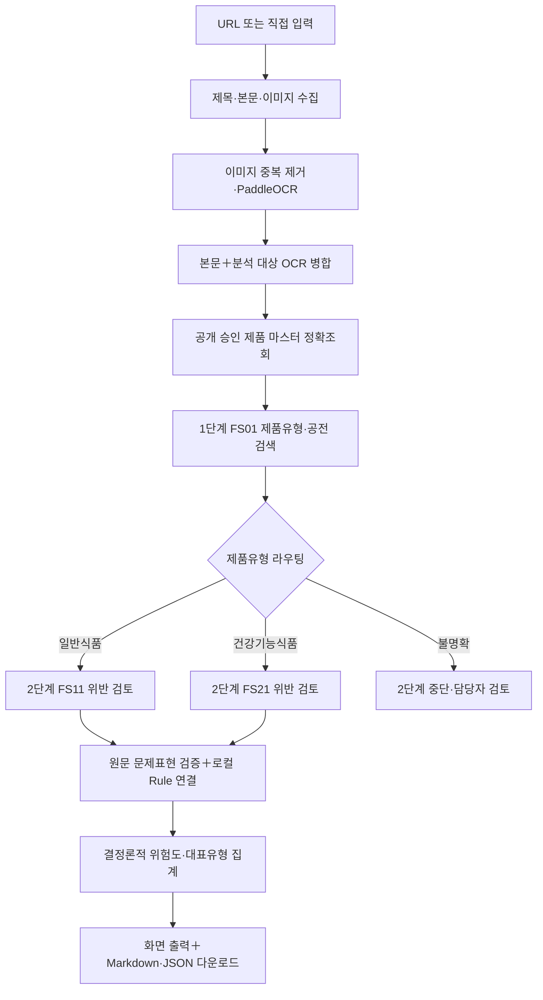

# MFDS 2단계 Cloud File Search OCR 검토 PoC

식품·건강기능식품 온라인 광고의 제품유형과 부당광고 가능성을 검토하는
Streamlit PoC이다. 공개 URL 수집, 서버 내 PaddleOCR 한국어 OCR, OpenAI Responses
API와 File Search를 이용한 2단계 분석, 로컬 Rule 연결, 결정론적 위험도 집계,
화면 출력 및 Markdown·JSON 다운로드를 하나의 앱에서 수행한다.

이 앱은 법적 최종 판단 도구가 아니라 담당자 검토 보조 도구이다. 결과에
표시된 원문 문제표현, Rule과 검색 발췌문을 담당자가 최종 확인해야 한다.

## 현재 범위

| 항목 | 현재 상태 |
| --- | --- |
| OpenAI 2단계 File Search | 활성 |
| URL 본문·이미지 수집 | 활성 |
| 서버 내 PaddleOCR 한국어 OCR | 활성 |
| 건강기능식품 제품 마스터 정확조회 | 활성 |
| 대칭적 제품유형 후보 라우팅 | 활성 |
| 로컬 Rule 연결 및 결정론적 위험도 집계 | 활성 |
| 결과 화면과 Markdown·JSON 다운로드 | 활성 |
| Gemini 비교 실행 | 일시 중단 |

- 시험 배포: <https://mfds-filesearch-ocr-poc.streamlit.app/>
- 독립 저장소: <https://github.com/alovrc/mfds-streamlit-ocr-poc>
- 원본 `alovrc/mfds-streamlit`의 운영 앱과 소스는 이 PoC 저장소에서 변경하지
  않는다.

## 빠른 시작

### 1. Python 환경 구성

권장 환경은 Python 3.12와 PaddleOCR 한국어 모델이다.

```powershell
python -m venv .venv
.\.venv\Scripts\python.exe -m pip install --upgrade pip
.\.venv\Scripts\python.exe -m pip install -r requirements.txt
```

### 2. 비밀값 설정

로컬에서는 `.streamlit/secrets.toml`을 생성하되 Git에 커밋하지 않는다.
필수값은 `OPENAI_API_KEY`와 세 Vector Store ID이며, 앱 접근을 제한할 때는
비밀번호 해시 설정도 함께 사용한다. 전체 예시는
[Streamlit Secrets](#streamlit-secrets) 절을 참고한다.

### 3. 앱 실행

```powershell
.\.venv\Scripts\python.exe -m streamlit run streamlit_app.py
```

기본 브라우저에서 `http://localhost:8501`을 열고 URL 또는 광고 문구를
입력한다. 실제 광고 자료를 사용하기 전에는 비식별 예제로 전체 흐름을 먼저
확인한다.

### 4. 회귀시험

```powershell
.\.venv\Scripts\python.exe -m compileall -q .
.\.venv\Scripts\python.exe -m pytest -q
```

## 프로젝트 구조

| 경로 | 역할 |
| --- | --- |
| `streamlit_app.py` | Streamlit 화면, 입력 검증, 분석 실행과 결과 다운로드 |
| `web_capture.py` | 공개 URL 보안검증, 본문·이미지 수집 |
| `ocr_pipeline.py` | 이미지 중복 제거와 PaddleOCR 한국어 OCR |
| `product_master.py` | 건강기능식품 제품 마스터 다운로드·무결성검사·정확조회 |
| `adapters/openai/` | OpenAI Responses API와 File Search 연동 |
| `prompts/`, `schemas/` | 단계별 프롬프트와 Structured Outputs 스키마 |
| `rule_catalog.py`, `rule_catalog.json` | 로컬 Rule 검증과 결정론적 연결 |
| `risk_aggregation.py`, `risk_rules.json` | 위험도와 대표유형 재계산 |
| `result_partition.py` | 유효 후보와 미해결 후보 분리 |
| `markdown_report.py` | 담당자용 Markdown 보고서 생성 |
| `scripts/` | Rule 코퍼스 변환·검증·업로드 보조도구 |
| `tests/` | 인증, 수집, OCR, 라우팅, Rule, 위험도와 UI 회귀시험 |
| `output/`, `tmp/` | 로컬 실행 산출물과 임시파일; Git 추적 제외 |

## 전체 처리 구조



## 데이터 배치

| 위치 | 자료 | 역할 |
| --- | --- | --- |
| GitHub 소스 | `rule_catalog.json`, `risk_rules.json`, 프롬프트, Schema, 집계 코드 | Rule 연결, 위험도와 대표유형 결정 |
| GitHub Release | 공개 승인 건강기능식품 제품 마스터 SQLite | 정규화 제품명 정확조회 |
| `FS01_PRODUCT_GATE` | 식품공전·건강기능식품공전 검색자료 | 제품유형과 인정 범위·예외 문맥 확인 |
| `FS11_FOOD_REVIEW` | 일반식품 검토용 공식근거·사례 | 일반식품 2단계 위반 검토 |
| `FS21_HFF_REVIEW` | 건강기능식품 검토용 공식근거·사례 | 건강기능식품 2단계 위반 검토 |
| Streamlit Secrets | API 키, 실제 Vector Store ID, 앱 인증값 | 배포 시 비밀값 주입 |

실제 Vector Store ID, API 키, 광고 원문과 File Search 업로드 파일은 GitHub에
커밋하지 않는다.

## 입력과 OCR

### 입력 항목

- 레코드 ID: 필수
- 원문 URL: 선택
- 게시물 제목: 선택
- 제품명: 선택
- 게시물 본문: 제목과 본문 중 하나 이상 필요
- 플랫폼: 선택

URL을 사용하면 앱이 공개 `http`·`https` 페이지의 제목, 본문과 이미지 URL을
수집한다. 네이버 블로그는 `mainFrame` 문서를 처리한다. 수집된 본문과 OCR
텍스트는 출처 구분자를 유지하여 병합되며, 담당자가 화면에서 수정한 OCR
문구가 있으면 수정본을 분석에 사용한다.

### OCR 정책

- Streamlit 서버에서 PaddleOCR 한국어 모델을 CPU로 실행한다.
- PP-OCRv5 한국어 인식 모델을 사용하며, OCR confidence는 저장·표시·판정에 사용하지 않는다.
- OpenAI OCR 또는 외부 OCR API는 호출하지 않는다.
- 한 페이지에서 최대 20개 이미지를 처리한다.
- URL·SHA-256 기준 중복 이미지를 제거한다.
- OCR confidence는 저장·표시·판정에 사용하지 않는다.
- 원본 OCR 텍스트와 담당자 수정 텍스트를 분리한다.

PoC OCR 레코드는 다음 최소 구조를 사용한다.

```json
{
  "source_id": "OCR_IMG_003",
  "image_url": "https://...",
  "ocr_text": "엔진 인식 원문",
  "reviewed_text": null,
  "ocr_status": "SUCCESS",
  "error_code": null,
  "included_in_analysis": true
}
```

분석 문구는 `reviewed_text or ocr_text`로 결정한다. 상태값은 다음 다섯 개만
사용한다.

```text
SUCCESS
PARTIAL_SUCCESS
NO_TEXT_DETECTED
FAILED
IMAGE_FETCH_FAILED
```

URL 수집기는 내부망·사설 IP, 사용자정보 포함 URL, 비표준 포트를 차단하고
리다이렉트 횟수, HTML·이미지 크기와 처리시간을 제한한다.

## 제품 마스터와 제품유형 라우팅

제품명이 입력되면 공개 승인된 83,687행 건강기능식품 제품 마스터를 조회한다.
제품 마스터는 GitHub Release의 버전 고정 SQLite로 배포되며 앱은 SHA-256,
행 수와 SQLite 무결성을 확인한 뒤 사용한다.

정규화 제품명이 유일하게 정확일치하는 경우에만 건강기능식품으로 확정하고
`FS21_HFF_REVIEW`로 라우팅한다. 미일치나 중복 제품명은 건강기능식품 확정
근거로 사용하지 않는다. 버전과 해시는
`data/product_master_manifest.json`에서 확인할 수 있다.

정확일치가 없으면 1단계의 `food_confidence`와 `hff_confidence`를 다음처럼
대칭 적용한다.

| 조건 | 처리 |
| --- | --- |
| `food_confidence >= 0.50`이고 건기식 점수보다 `0.05` 초과하여 높음 | 일반식품 후보, FS11 |
| `hff_confidence >= 0.50`이고 식품 점수보다 `0.05` 초과하여 높음 | 건강기능식품 후보, FS21 |
| 두 점수가 모두 `0.50` 미만 | 품목 불명확, 2단계 중단 |
| 두 점수 차이가 `0.05` 이하 | 품목 불명확, 2단계 중단 |
| 제품유형 근거가 상충 | 품목 불명확, 2단계 중단 |

확률 기반 라우팅은 제품유형 확정이 아니라 검토 경로를 정하는 후보 기준이며
담당자 검토가 필요하다.

## 위반 후보와 근거 기준

활성 위반 후보는 다음 두 조건을 모두 충족하면 유효하다.

1. 입력 원문에서 그대로 확인되는 제품 연결 문제표현이 있다.
2. 해당 위반유형에 대응하는 활성 로컬 Rule ID가 연결된다.

모델이 반환한 Rule ID는 사용하지 않는다. 앱이 후보 위반유형과 제품 경로를
기준으로 `rule_catalog.json`의 Rule을 결정론적으로 연결한다. Rule
카탈로그에는 법령명, 조항, 시행일, 원천 URL, 적용 조건, 판단 설명과 원천
파일 SHA-256이 포함된다.

File Search의 공식근거 ID와 사례 ID는 출처 추적과 추가 확인을 위한
보조근거이다. 공식근거 ID가 없다는 이유만으로 후보의 상태나 위험도를 낮추지
않으며 `INSUFFICIENT_EVIDENCE`로 처리하지 않는다. 또한 보조 공식근거가
검색되지 않았다는 문구나 `SEARCH_NO_OFFICIAL_EVIDENCE` 코드는 화면과
Markdown 보고서에 표시하지 않는다. 실제 공식근거가 검색된 경우에만 해당
근거를 표시한다.

다음 경우에는 후보를 `INSUFFICIENT_EVIDENCE`로 격리하고 위험도 집계에서
제외한다.

- 문제표현이 입력 원문에서 확인되지 않음
- 제품과 연결된 유효 문제표현이 없음
- 대응하는 활성 로컬 Rule ID가 없음

유효 후보가 하나라도 있으면 레코드 전체 근거상태는
`SUFFICIENT_EVIDENCE`이다. 다른 미해결 후보가 함께 있어도 유효 후보의
상태를 낮추지 않으며, 미해결 후보만 별도로 담당자 검토 대상으로 남긴다.

## 결정론적 위험도와 대표유형

모델이 반환한 위험도는 후보값이다. 최종 위험도는 `risk_rules.json`으로
재계산한다.

- 제8조제1항 제1호 질병 예방·치료 효능: 10점
- 제8조제1항 제2호 의약품 오인·혼동: 10점
- 제8조제1항 제3호 건강기능식품 오인·혼동: 9점
- 제8조제1항 제4호 거짓·과장: 세부유형에 따라 8~9점
- 제8조제1항 제5호 소비자 기만: 세부유형에 따라 7~8점

조항별 위험도는 최댓값으로 산출하며 합산하거나 평균하지 않는다. 발생 횟수는
제품·조항·판단유형별 고유 `expression_id`를 기준으로 중복 제거하여
계산한다.

대표유형은 다음 두 기준을 각각 산출한다.

- 최다빈도 대표유형: 발생 횟수를 우선한다.
- 최고위험 대표유형: 위험도 점수를 우선한다.

두 기준이 같은 조항을 선택하면 하나의 대표유형에 두 선정기준을 함께
표시한다. 제1호와 제2호가 위험도·발생 횟수까지 완전히 동률이면 행정처분
강도가 높은 제1호를 우선한다. 비교·비방은 현재 제1호~제5호 집계 범위 밖이므로
탐지 후보에는 남길 수 있지만 전체 위험도와 대표유형에는 포함하지 않는다.

## OpenAI API 호출 수

단일 제품 한 건의 논리 호출 수는 다음과 같다.

| 처리 결과 | Responses API 논리 호출 수 |
| --- | ---: |
| 제품유형 불명확으로 2단계 중단 | 1회 |
| 일반식품 또는 건강기능식품으로 라우팅 | 2회 |
| 로컬 Rule 연결 | 추가 호출 0회 |
| PaddleOCR | OpenAI 호출 0회 |

정상 경로의 2회는 `FS01` 제품유형 검색 1회와 `FS11` 또는 `FS21` 위반 검토
1회이다. 다제품 입력은 1단계 1회에 라우팅된 제품별 2단계 호출이 추가된다.
일시적인 공급자 오류가 발생하면 각 논리 호출에서 한 번 재시도할 수 있다.

기본 모델은 `gpt-5.6-sol`이며 Streamlit Secrets의 `OPENAI_MODEL`로 변경할 수
있다. 모든 Responses API 요청은 Structured Outputs를 사용하고
`store=false`로 실행한다.

## 결과 화면과 다운로드

앱은 다음 결과를 표시한다.

- 제품별 제품유형과 식품·건강기능식품 confidence
- 위반 가능 항목과 동일 광고 내 고유 문제표현 수
- 입력 원문에서 확인된 문제표현
- 적용 Rule ID, 법령·조항, 적용 조건과 판단 설명
- 검색된 경우에 한한 공식근거·사례 파일명과 발췌문
- 결정론적 위험도와 최다빈도·최고위험 대표유형
- 유효 후보와 미해결 후보
- 담당자 검토 필요 여부

다운로드 파일은 다음 세 종류이다.

- 담당자용 Markdown 결과보고서
- 독립검토 JSON
- 검증된 전체 파이프라인 JSON

## Streamlit Secrets

실제 값은 `.streamlit/secrets.toml`이나 GitHub에 저장하지 않고 Streamlit
Community Cloud의 앱 설정에서만 관리한다.

```toml
APP_PASSWORD_SALT = "..."
APP_PASSWORD_HASH = "..."
APP_PASSWORD_ITERATIONS = 600000

OPENAI_API_KEY = "..."
OPENAI_MODEL = "gpt-5.6-sol"
OPENAI_REASONING_EFFORT = "medium"

OPENAI_FS01_PRODUCT_GATE_STORE_ID = "vs_..."
OPENAI_FS11_FOOD_REVIEW_STORE_ID = "vs_..."
OPENAI_FS21_HFF_REVIEW_STORE_ID = "vs_..."
```

Vector Store ID가 없거나 현재 OpenAI 프로젝트에서 유효하지 않으면 앱은
저장소 이름으로 유일한 저장소를 찾아 사용한다. 같은 이름의 저장소가 여러
개이면 안전하게 실패한다.

## 로컬 실행

권장 Python 버전은 Streamlit 배포와 동일한 3.12이다.

```powershell
python -m venv .venv
.\.venv\Scripts\python.exe -m pip install -r requirements.txt
.\.venv\Scripts\python.exe -m streamlit run streamlit_app.py
```

PaddleOCR와 PaddlePaddle은 `requirements.txt`로 설치하며, 별도 Tesseract 실행파일이나 언어팩은 필요하지 않다. 첫 OCR 실행 시 한국어 모델을 내려받아 임시 캐시에 유지한다.

로컬 환경변수로 제품 마스터와 OpenAI 설정을 재정의할 수 있다.

```text
MFDS_PRODUCT_MASTER_PATH
MFDS_PRODUCT_MASTER_URL
MFDS_PRODUCT_MASTER_SHA256
OPENAI_API_KEY
OPENAI_MODEL
OPENAI_REASONING_EFFORT
OPENAI_TIMEOUT_SECONDS
OPENAI_FS01_PRODUCT_GATE_STORE_ID
OPENAI_FS11_FOOD_REVIEW_STORE_ID
OPENAI_FS21_HFF_REVIEW_STORE_ID
```

## 검증

```powershell
.\.venv\Scripts\python.exe -m compileall -q .
.\.venv\Scripts\python.exe -m pytest -q
```

회귀시험에서는 다음을 확인한다.

1. 앱 비밀번호 인증과 비밀값 비노출
2. URL 보안검증, 네이버 블로그 본문·이미지 수집
3. 이미지 중복 제거, OCR 상태와 담당자 수정 문구 반영
4. 제품 마스터 유일 정확조회와 FS21 라우팅
5. `0.50` 임계값·`0.05` 동률폭의 대칭 라우팅
6. FS01 및 FS11·FS21 File Search 실행과 citation 발췌문
7. 원문에 없는 문제표현 격리
8. 로컬 Rule 연결과 Rule 원천정보 표시
9. 공식근거 미검색이 상태·점수를 낮추지 않으며 화면·Markdown에 노출되지 않음
10. 결정론적 위험도, 제1호·제2호 동률 우선순위와 대표유형
11. Markdown·독립검토 JSON·전체 JSON 다운로드

## 공개 저장소 관리

공개 저장소에 포함하는 항목:

- Streamlit Python 소스
- 프롬프트와 JSON Schema
- 로컬 Rule·위험도 기준과 결정론적 집계 코드
- 변환·검증 스크립트
- 합성·비식별 테스트
- 공개 승인 제품 마스터 manifest

공개 저장소에서 제외하는 항목:

- OpenAI·Gemini API 키
- 실제 Vector Store ID
- `.streamlit/secrets.toml`, `.env*`
- File Search 업로드용 실제 파일
- 실제 광고 원문, 이미지와 내부자료
- 실행 캐시와 임시 산출물

## 운영 전 확인사항

- 이 앱의 결과는 부당광고 가능성 검토를 돕는 참고자료이며 법적 최종 판단이
  아니다.
- 실제 Vector Store가 올바른 자료와 버전을 가리키는지 확인한다.
- 제품 마스터의 행 수·SHA-256·SQLite 무결성검사 결과를 확인한다.
- OCR 원문과 담당자 수정문을 구분해 보존하고, 수정문이 분석에 사용됐는지
  확인한다.
- 입력 원문에서 확인되지 않는 문제표현과 비활성 Rule은 위험도 집계에서
  제외되는지 확인한다.
- API 키, 인증정보, 실제 광고 원문과 내부자료가 Git·로그·다운로드 예제에
  포함되지 않았는지 확인한다.
- 배포 전 전체 회귀시험을 통과시키고 Streamlit Secrets를 운영 환경에서
  별도로 설정한다.
